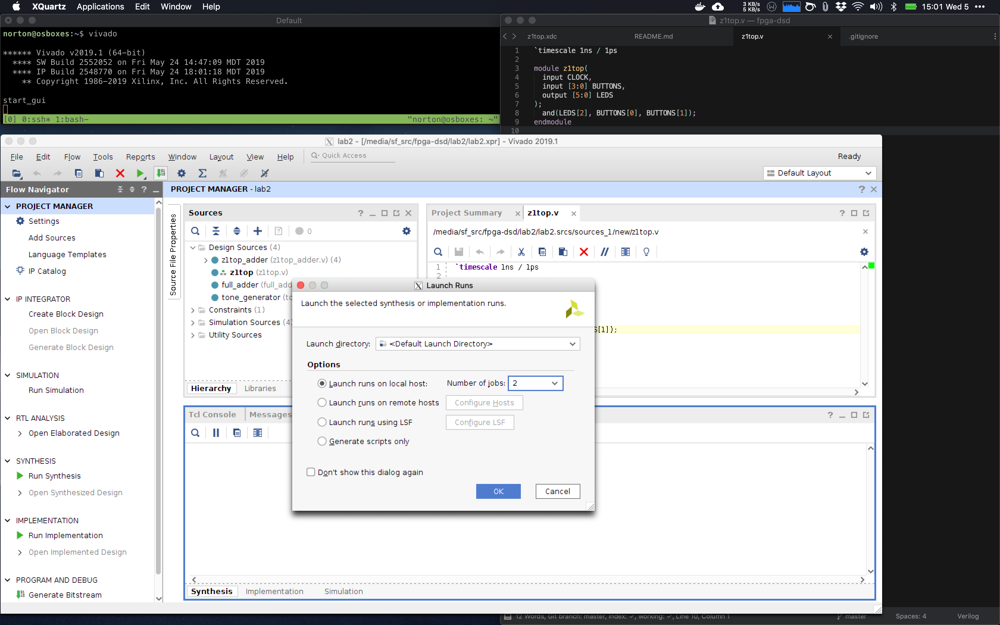

# FPGA Digital Systems Design

## Hardware

[Cora Z7-07S](https://reference.digilentinc.com/reference/programmable-logic/cora-z7/start)

[Reference Manual](https://reference.digilentinc.com/reference/programmable-logic/cora-z7/reference-manual)

## Software

- VirtualBox
- Ubuntu 18.04
- Xilinx Vivado 2019.1 HLx Edition
- Icarus Verilog
- GTKWave

## Links

- https://www.eevblog.com/forum/fpga/using-vivado-in-tcl-mode/
- http://www.clifford.at/yosys/cmd_synth_xilinx.html
- https://symbiflow.github.io/
- https://github.com/dalance/sv-parser
- https://github.com/dalance/sv-parser
- https://github.com/google/verible
- https://en.wikipedia.org/wiki/Plasma_ashing
- https://en.wikipedia.org/wiki/Electromagnetic_spectrum

## Coursework

- [EECS151 Fall 2019](http://inst.eecs.berkeley.edu/~eecs151/fa19/)
- [EECS151 FPGA Labs](https://github.com/EECS150/fpga_labs_fa19)

## macOS Development

